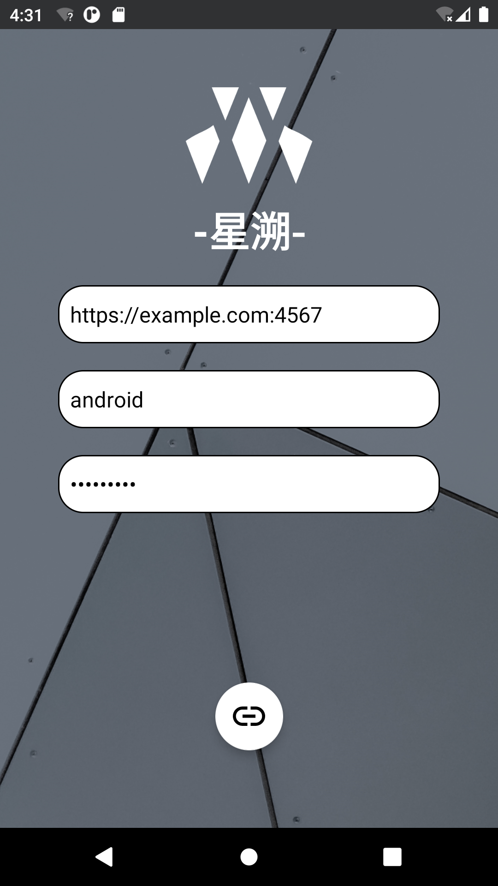
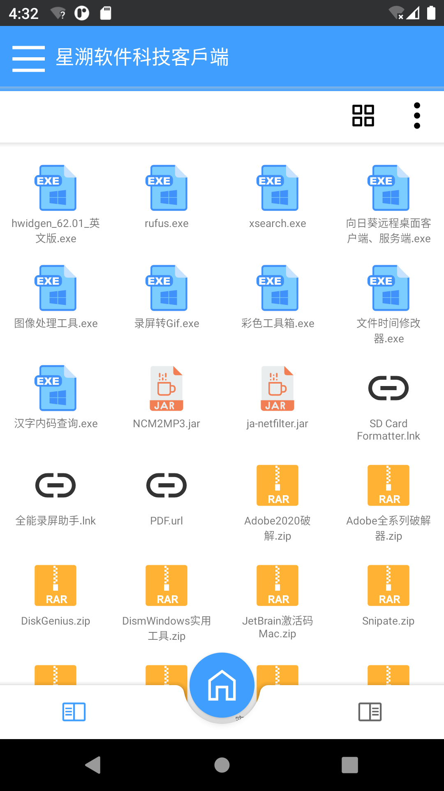

## MinioClient-ForAndroid

MinioClient-ForAndroid提供了一个可以直接从安卓客户端下载MinIO服务器文件的方式，其原始项目来自于[botanik42rus/FileExplorer_Android (github.com)](https://github.com/botanik42rus/FileExplorer_Android)，一个文件管理器。借用其布局，将文件提供方从本地改为我们的minio服务器。

MinioClient-ForAndroid provides a way to download MinIO server files directly from the Android client. Its original project comes from [botanik42rus/FileExplorer_Android (github.com)](https://github.com/botanik42rus/FileExplorer_Android), a file manager. Borrow its layout and change the file provider from local to our minio server.

其中引用了两个来自github的组件库，很好的实现了Toast以及WebView

It references two component libraries from github, which implements Toast and WebView very well.

```
[delight-im/Android-AdvancedWebView: Enhanced WebView component for Android that works as intended out of the box (github.com)](https://github.com/delight-im/Android-AdvancedWebView)

[GrenderG/Toasty: The usual Toast, but with steroids 💪 (github.com)](https://github.com/GrenderG/Toasty)
```

## 使用方法/Usage

只需要在登录界面输入服务器的endpoint以及credentials即可

Just enter the endpoint and credentials of the server on the login interface






 **mawserver@foxmail.com 连旭灿进行的修改，如果你有各种软件需求欢迎联系**